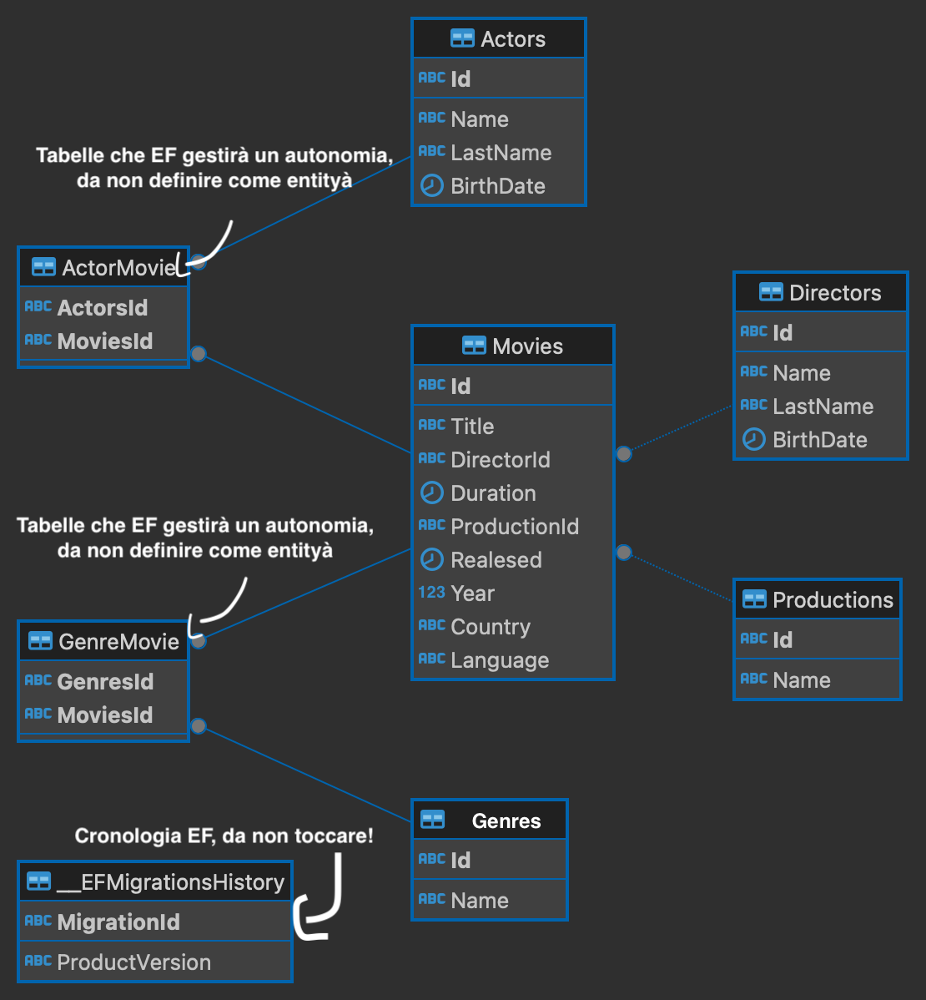

# Corso SSATI Aspnet Core
Task list per il corso SSATI, MIP e Commit, creazione di un catalogo 🎥

## Introduzione
Ciao in questa esercitazione ci eserciteremo nello sviluppo quanto più ampio di un app backend. L'obiettivo è di adoperare tutti i concetti chiave di cui è composto una web api. Svilupperemo insieme un servizio che esponde delle api per la gestione di un catalogo di film. Iniziamo! 🚀

## Task
- [ ] Creare un progetto da zero, con IDE o meglio ancora da command line ` dotet new webapi -n <Nome Progetto>` (saper eseguire comandi da terminale ti rende apparentemente più skillato 😉)
- [ ] Installare pacchetti Entity Framework SQL Server e Entity Framework Design da riga di commando o da IDE [qui](https://learn.microsoft.com/it-it/aspnet/core/data/ef-mvc/intro?view=aspnetcore-8.0) puoi trovare la documentaione ufficiale di Microsoft
- [ ] Configurare Entity Framework
    - [ ] Crea un ApplicationDbContext
    - [ ] Sql connection per dbcontext
    - [ ] Definire la struttura del DB, vedi [qui](#Database) la struttura del db)
    - [ ] Dopodiché scrivi le entities necessarie e configura il modelBuilder in applicationDbContext
    - [ ] Configurazione della Dependency Injection 
    - [ ] Aggiungere la prima migrazione
    - [ ] Configurare il Seed Data [qui](https://www.learnentityframeworkcore.com/migrations/seeding) un articolo che mostra un esempio
      - [ ] Leggere da [questo](https://github.com/erik-sytnyk/movies-list/blob/master/db.json) db in Json
      - [ ] Aggiungere i dati appena letti nel proprio DB
- [ ] Scrivere ed usare repository delle proprie entità
- [ ] Eseguire operazioni CRUD per l'entità definite definendole come service, per esempio MovieService, nel quale sarà presete la create, read, update e delete di un film
- [ ] Creare controller con le operazioni CRUD per ogni entità per rispettare il protocollo REST, quindi rispetta i protocolli http per ogni tipo di richiesta
- [ ] Esercitati con alcune soluzioni di elaborazione dati in SQL
  - [ ] Scrivere una query in SQL che ottiene il numero totale di tutti i film per uno o più generi
  - [ ] Scrivere una query in linq che ottiene 
- [ ] Costruire un UitOfWork
- [ ] Definire un middlware che controlla il tipo di richiesta e limita l'utilizzo solo ai dispositivi mobile
- [ ] Esegui test con Postman
- [ ] Aggiungi una autenticazione, in questo caso Asp.Net Core Identity
- [ ] Crea una repo su GitHub e condividela con [me](https://github.com/giovamuge)

## Database

## Considerazioni finali

Un'applicazione backend che espone servizi ad altri applicativi via web, seguendo il protocollo più idoneo alle proprie esigenze, rappresenta una delle sfide più impegnative nel percorso di sofware developer. Non preoccuparti! Anche se sei un dev con qualche anno di esperienza, è facile incappare negli errori comuni come loop infiniti, punti e virgola mancanti, allocazione incontrollata di RAM, richieste troppo grandi e onerose al database che rallentano la tua app, e molti altri.

Il mio consiglio è di non temere, poiché i programmatori, sebbene possano sembrare asociali, sono spesso molto altruisti e lavorano per il bene comune della comunità di sviluppatori. Ricorda sempre che `Google è il tuo migliore amico` (e da un po' di tempo anche ChatGPT), ma ti consiglio di imparare a condurre ricerche efficaci su Google. Quasi sempre, tutto ciò di cui hai bisogno è già disponibile su Internet.

Ciò non significa che tu debba copiare in modo indiscriminato tutto ciò che trovi durante le tue ricerche, ma piuttosto impara ad analizzare e trarre ispirazione dalle idee e dalle soluzioni che incontri per contribuire a creare un mondo migliore per tutti i programmatori!

Un altro consiglio importante è studiare le `Best Practices` e i `Design Patterns`, come ad esempio SOLID, per scrivere codice scalabile, leggibile e performante. 

> Tutti questi consigli non vogliono essere appunti presuntuosi, ma semplici ed umili condivisioni.

Non smettere mai di studiare e sperimentare nuove tecnologie o quelle che stai utilizzando attualmente. Buon sviluppo!
